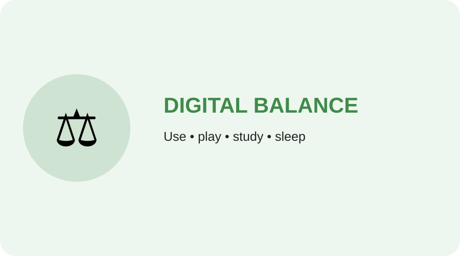

## 👧 Child awareness by age group

### 🟢 Classes 1–5 — Healthy Screen Habits

<b>Ask</b> Ask a parent before using a device.

<b>Break</b> Take breaks from screens.

<b>Play</b> Play outside and move your body.

<b>Sleep</b> Put the device away at bedtime.

### 🔵 Classes 6–8 — Balance Technology & Life

- Control unnecessary screen time.
- Avoid phones during study.
- Use earphones responsibly.
- Protect sleep.
- Exercise and develop a hobby.

### 🟣 Classes 9–12 — Digital Responsibility

- Use technology for learning and creativity.
- Avoid excessive social-media use.
- Protect sleep and concentration.
- Balance academics, technology, health and relationships.
- Build real-world skills and responsible habits.

## Remember

> **Technology is a tool. You are in control of how you use it.**
