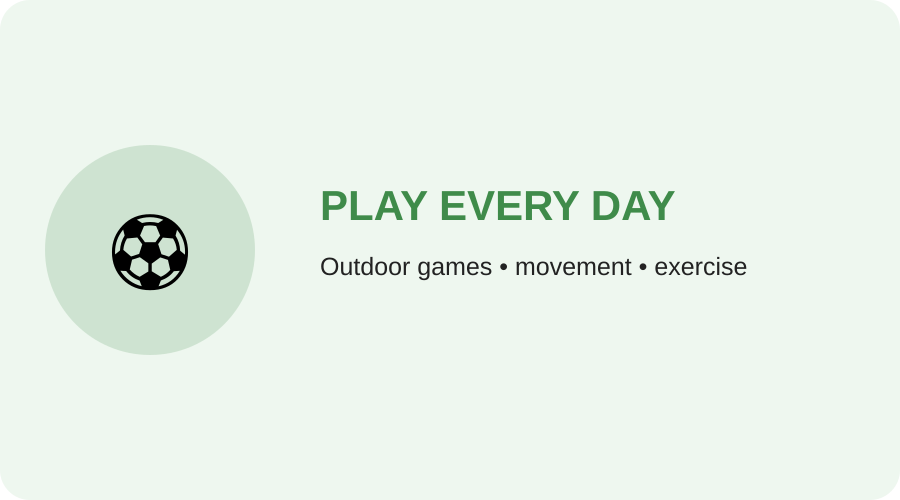
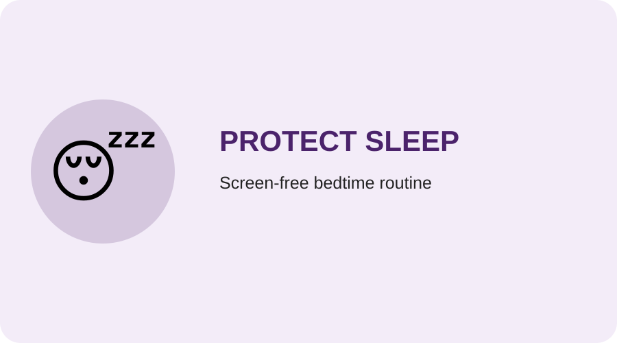
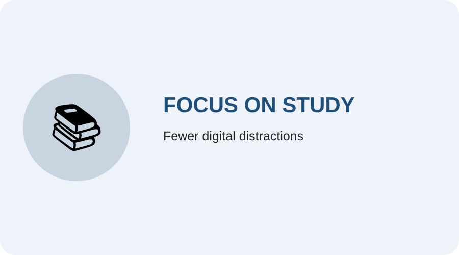
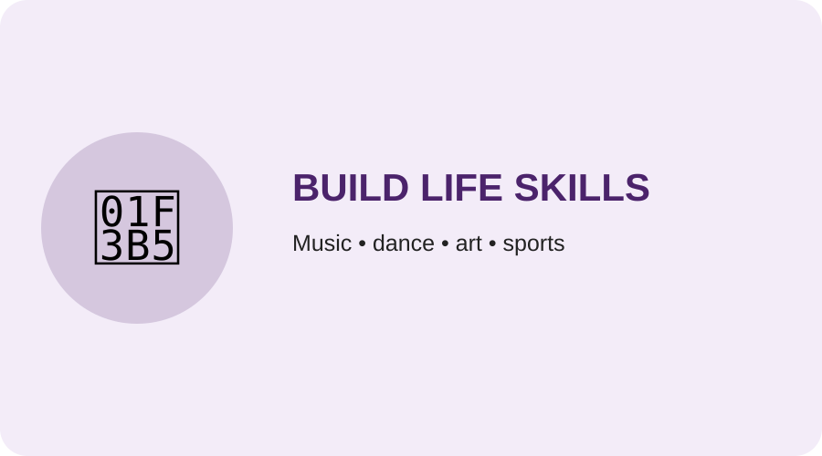

## Healthy habits for Classes 1–12

The same core message can be taught at different levels: **use technology responsibly, sleep well, move daily, study with focus and develop real-world skills.**

<h3>🏃 Move every day</h3>

<b>Classes 1–5:</b> Play outside every day.

<b>Classes 6–8:</b> Balance screen time with outdoor activity.

<b>Classes 9–12:</b> Protect time for exercise, sports or walking.

<h3>😴 Protect sleep</h3>

Keep screens away during bedtime and create a calm night routine.

<h3>📚 Study with focus</h3>

Reduce unnecessary notifications and distractions while studying.

<h3>🎵 Build life skills</h3>

Encourage music, dance, art, sports, reading, creativity and practical skills.

## Simple child message

> **Use technology → Play → Study → Talk → Sleep**

Technology should support childhood, not replace sleep, movement, relationships and learning.
