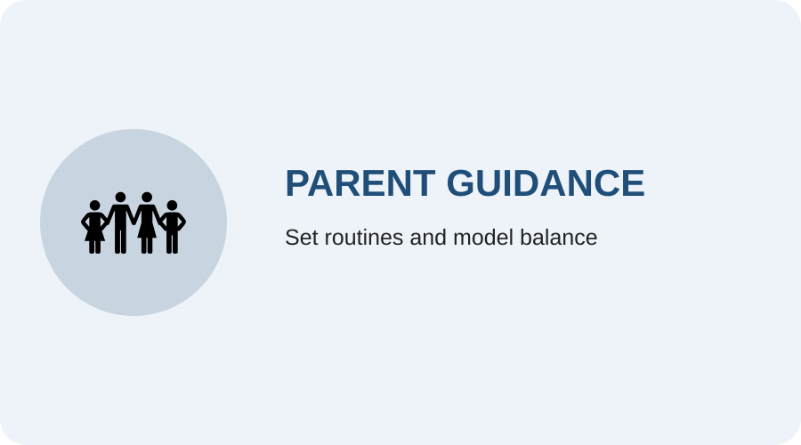
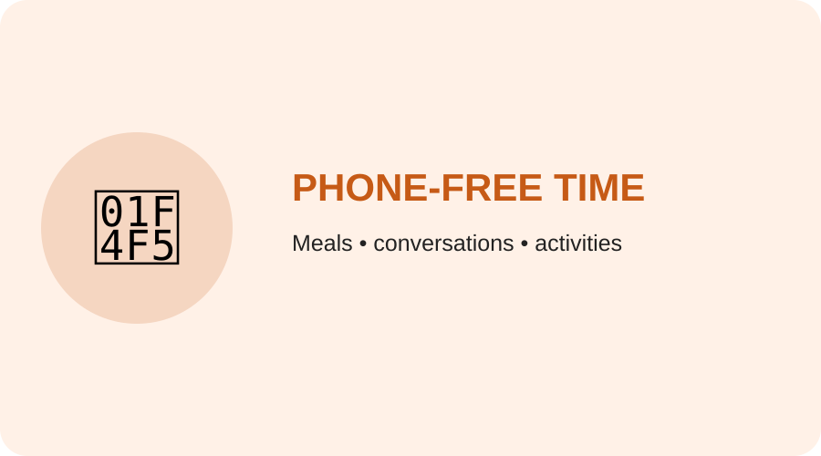
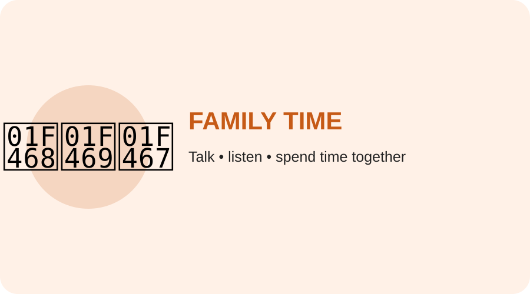

## 👨‍👩‍👧 Parent awareness

Parents can help children develop healthy digital routines without treating technology as completely negative.

<h3>Guide, don't just restrict</h3>

Set clear routines and explain why limits are useful.

<h3>Create phone-free family time</h3>

Meals, conversations and family activities should include real interaction.

<h3>Replace screen convenience</h3>

For young children, use talking, reading, play and interaction instead of relying on a device for every difficult moment.

<h3>Encourage active childhood</h3>

Support outdoor play, sports, hobbies, music, dance and other skills.

## Parent takeaway

**Model the behaviour you want children to learn.** A family routine that includes sleep, physical activity, conversation, study and responsible technology use is more useful than a simple “no phone” rule.
